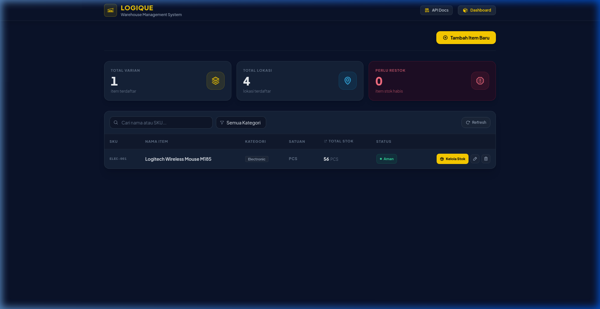
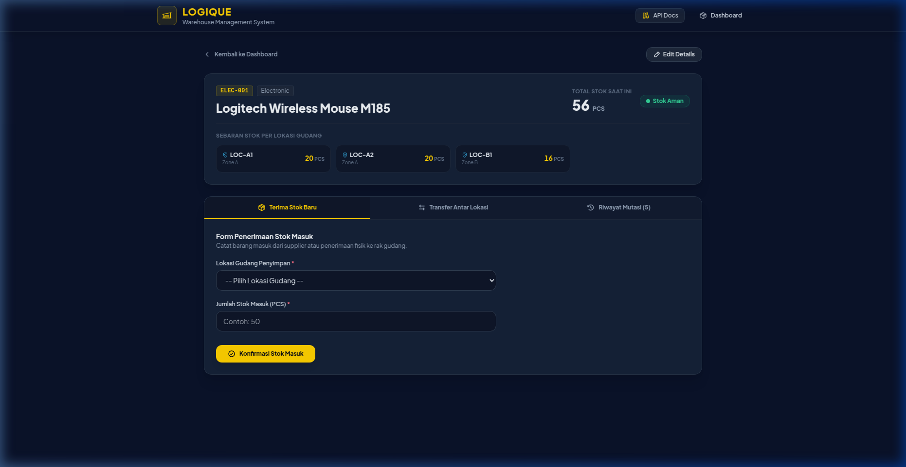

# LOGIQUE Warehouse Management System


**Demo:** https://logique-warehouse-management.vercel.app

Sistem manajemen gudang berbasis web untuk mencatat barang masuk, memantau stok per lokasi rak, dan mentransfer stok antar lokasi gudang.

---

## Tampilan Aplikasi

**Dashboard Utama** — Ringkasan stok, filter kategori, dan indikator status barang secara real-time.



**Halaman Kelola Stok** — Detail sebaran stok per lokasi, form penerimaan stok masuk, transfer antar lokasi, dan riwayat mutasi.



---

## Tech Stack

| Layer | Teknologi |
| :--- | :--- |
| **Backend** | Go 1.23 · Gin Framework · `database/sql` + `lib/pq` |
| **Database** | PostgreSQL 15 |
| **Frontend** | React 18 · TypeScript · Vite · Tailwind CSS v3 |
| **State Management** | TanStack Query (React Query v5) |
| **API Docs** | OpenAPI 3.0 (Swagger UI) |
| **Containerization** | Docker · Docker Compose |
| **Production DB** | Neon PostgreSQL (Serverless) |
| **Frontend Hosting** | Vercel |

---

## Fitur

### Core (Wajib)
- **CRUD Barang** — Tambah, lihat, edit, dan hapus (soft delete) item gudang
- **SKU Unik** — Validasi duplikasi SKU pada level database (partial unique index)
- **Filter & Search** — Filter berdasarkan kategori dan pencarian nama/SKU
- **Penerimaan Stok** — Catat barang masuk ke lokasi gudang tertentu
- **Riwayat Mutasi** — Log setiap perubahan stok beserta saldo akhir

### Bonus (Nilai Tambah)
- **`GET /api/v1/locations`** — Daftar lokasi gudang dinamis dari database (tidak hardcoded di frontend)
- **`POST /api/v1/stock/transfer`** — Transfer stok antar lokasi gudang dengan validasi stok mencukupi
- **Indikator Status Stok** — Badge visual: `Aman` (>20), `Menipis` (1–20), `Habis` (0)
- **Dashboard Summary Cards** — Total varian, total lokasi aktif, dan counter item perlu restok
- **Swagger UI** — Dokumentasi API interaktif di `/docs`

---

## Arsitektur & Struktur Folder

Proyek menggunakan **Layered Architecture** (Handler → Service → Repository) untuk memisahkan tanggung jawab setiap lapisan.

```
logique-warehouse-management/
├── backend/
│   ├── cmd/api/
│   │   └── main.go              # Entry point, route registration
│   ├── internal/
│   │   ├── handler/             # HTTP layer: parse request, call service, write response
│   │   │   ├── item_handler.go
│   │   │   ├── stock_handler.go
│   │   │   ├── location_handler.go
│   │   │   └── middleware.go    # Logger & central error handler
│   │   ├── service/             # Business logic layer
│   │   │   ├── item_service.go
│   │   │   ├── stock_service.go
│   │   │   └── location_service.go
│   │   ├── repository/          # Data access layer (raw SQL)
│   │   │   ├── item_repository.go
│   │   │   ├── stock_repository.go
│   │   │   └── location_repository.go
│   │   ├── model/               # Structs: request/response/domain models
│   │   └── database/            # DB init & auto-migration runner
│   ├── migrations/
│   │   └── 000001_init_schema.up.sql
│   └── docs/
│       └── swagger.yaml
├── frontend/
│   └── src/
│       ├── pages/               # DashboardPage, ItemFormPage, StockManagePage
│       ├── components/          # Navbar, toast system, reusable UI
│       ├── services/            # Axios API clients (itemService, stockService)
│       ├── hooks/               # Custom React hooks
│       └── types/               # TypeScript interfaces
└── docker-compose.yml
```

---

## Skema Database

```sql
-- Item dengan soft delete dan SKU unik (partial index)
items         (id UUID, sku, name, category, unit, created_at, updated_at, deleted_at)

-- Lokasi rak fisik di gudang
locations     (id UUID, code, zone, type, created_at)

-- Stok per item per lokasi (qty >= 0 dijaga di level DB)
stocks        (id UUID, item_id → items, location_id → locations, qty INT CHECK(qty >= 0))

-- Audit trail setiap mutasi stok
stock_mutation_logs (id UUID, item_id, location_id, type VARCHAR, qty_change INT, balance_after INT, created_at)
```

**Seed data lokasi default:**

| Kode | Zone | Tipe |
| :--- | :--- | :--- |
| `LOC-A1` | Zone A | Shelf |
| `LOC-A2` | Zone A | Shelf |
| `LOC-B1` | Zone B | Pallet |
| `COLD-01` | Cold Storage | Refrigerated |

---

## Cara Menjalankan

### Cara 1: Docker Compose (Direkomendasikan)

Pastikan Docker dan Docker Compose sudah terinstall.

```bash
# Clone repository
git clone https://github.com/AbdLateef/logique-warehouse-management.git
cd logique-warehouse-management

# Jalankan semua service (postgres + backend + frontend)
docker compose up --build
```

Setelah selesai build, akses:
- **Frontend**: http://localhost:3000
- **Backend API**: http://localhost:8080
- **Swagger Docs**: http://localhost:8080/docs

> Database otomatis dibuat dan di-migrate saat pertama kali container backend berjalan.

---

### Cara 2: Manual (Tanpa Docker)

**Prasyarat:** Go 1.23+, Node.js 18+, PostgreSQL 15

**1. Setup Backend**

```bash
cd backend

# Buat file .env
cat > .env << EOF
PORT=8080
DB_HOST=localhost
DB_PORT=5432
DB_USER=postgres
DB_PASSWORD=postgres
DB_NAME=warehouse_db
DB_SSLMODE=disable
EOF

# Jalankan server
go run ./cmd/api/main.go
```

**2. Setup Frontend**

```bash
cd frontend

npm install

# Sesuaikan jika backend berjalan di port lain
echo "VITE_API_BASE_URL=http://localhost:8080" > .env.local

npm run dev
```

Frontend tersedia di: http://localhost:5173

---

## API Endpoints

| Method | Endpoint | Deskripsi |
| :--- | :--- | :--- |
| `POST` | `/api/v1/items` | Tambah item baru |
| `GET` | `/api/v1/items` | Daftar item (`category`, `search`, `page`, `limit`) |
| `GET` | `/api/v1/items/categories` | Daftar kategori unik |
| `GET` | `/api/v1/items/:id` | Detail item |
| `PUT` | `/api/v1/items/:id` | Update item |
| `DELETE` | `/api/v1/items/:id` | Soft delete item |
| `POST` | `/api/v1/stock/receive` | Terima stok masuk ke lokasi |
| `POST` | `/api/v1/stock/transfer` | Transfer stok antar lokasi *(bonus)* |
| `GET` | `/api/v1/stock/:item_id` | Stok per lokasi untuk satu item |
| `GET` | `/api/v1/stock/:item_id/logs` | Riwayat mutasi stok |
| `GET` | `/api/v1/locations` | Daftar lokasi gudang *(bonus)* |
| `GET` | `/health` | Health check |
| `GET` | `/docs` | Swagger UI interaktif |

**Format response standar:**
```json
{
  "success": true,
  "data": { ... },
  "message": "Item created successfully"
}
```

---

## Keputusan Teknis & Trade-off

### 1. Layered Architecture: Handler → Service → Repository

**Keputusan:** Memisahkan kode ke tiga lapisan berbeda, bukan meletakkan semua logika di handler.

**Alasan:** Handler hanya bertanggung jawab terhadap HTTP — parsing request dan menulis response. Validasi bisnis (seperti "SKU sudah ada?", "stok mencukupi untuk transfer?") ada di Service. Query SQL ada di Repository. Setiap lapisan bisa diuji secara independen dan mudah diperluas.

**Trade-off:** Menambah jumlah file dan boilerplate awal dibandingkan jika semua logika ditulis langsung di handler. Untuk skala proyek ini, overhead tersebut sepadan karena setiap lapisan bisa dikembangkan dan diuji secara independen.

---

### 2. Soft Delete pada Item, bukan Hard Delete

**Keputusan:** Field `deleted_at TIMESTAMPTZ NULL` dipakai sebagai penanda item sudah dihapus.

**Alasan:** Riwayat mutasi stok (`stock_mutation_logs`) berelasi ke `item_id`. Jika item dihapus secara permanen, semua log mutasinya menjadi orphan dan tidak bisa diaudit. Soft delete mempertahankan integritas data historis.

**Trade-off:** Query `SELECT` harus selalu menyertakan `WHERE deleted_at IS NULL`. Ditangani dengan partial unique index: `CREATE UNIQUE INDEX ON items(sku) WHERE deleted_at IS NULL`, sehingga SKU yang sama bisa dipakai ulang setelah item dihapus.

---

### 3. UUID sebagai Primary Key

**Keputusan:** Semua tabel menggunakan UUID (`gen_random_uuid()`), bukan `SERIAL` auto-increment.

**Alasan:** UUID aman untuk di-expose ke client (tidak bisa ditebak urutannya) dan mendukung distribusi data jika database di-shard di masa depan.

**Trade-off:** UUID lebih besar secara storage (16 byte vs 4-8 byte) dan sedikit lebih lambat untuk operasi JOIN pada tabel besar. Untuk skala gudang ini, trade-off tersebut tidak berpengaruh signifikan.

---

### 4. Raw SQL, Tidak Memakai ORM

**Keputusan:** Semua query database ditulis menggunakan `database/sql` dan `lib/pq`, tanpa ORM seperti GORM.

**Alasan:** Memberikan kontrol penuh terhadap query yang dieksekusi. Khususnya untuk operasi transfer stok yang melibatkan database transaction dengan multiple UPDATE dan INSERT, menulis SQL langsung lebih aman dan hasilnya lebih mudah diprediksi.

**Trade-off:** Membutuhkan lebih banyak kode boilerplate untuk scanning hasil query. Migrasi dikelola secara manual lewat file `.sql`.

---

### 5. Constraint `CHECK (qty >= 0)` di Level Database

**Keputusan:** Kolom `qty` pada tabel `stocks` memiliki constraint `CHECK (qty >= 0)`.

**Alasan:** Validasi di Service layer bisa saja dilewati oleh bug atau race condition pada concurrent request. Constraint di database berfungsi sebagai safeguard terakhir — database menolak `UPDATE` yang akan membuat stok negatif, terlepas dari logika aplikasi.

**Trade-off:** Database mengembalikan error jika constraint dilanggar, yang harus ditangkap di repository layer dan dikonversi ke error yang bermakna bagi pengguna.

---

## Deklarasi Penggunaan AI Tools

Proyek ini dikerjakan dengan bantuan **Antigravity (AI Coding Assistant berbasis Google Deepmind)** sebagai pair programmer.

**Peran AI:**
- Penulisan query SQL berdasarkan skema yang sudah dirancang
- Implementasi struktur kode sesuai arahan arsitektur
- Debugging error runtime (konfigurasi CORS, koneksi DB di Docker)

**Peran Manusia (pengembang):**
- Perancangan arsitektur keseluruhan (layered architecture, soft delete, UUID, raw SQL vs ORM)
- Penentuan struktur folder dan pembagian tanggung jawab tiap lapisan (handler, service, repository)
- Validasi setiap logika bisnis yang dihasilkan AI sebelum dieksekusi
- Penentuan threshold indikator stok dan desain UI/UX
- Review dan koreksi kode yang tidak sesuai dengan kebutuhan bisnis

> AI digunakan sebagai alat percepatan pengembangan, bukan sebagai pengganti pemahaman teknis. Seluruh kode yang masuk ke repository sudah dipahami dan divalidasi oleh pengembang.

---
